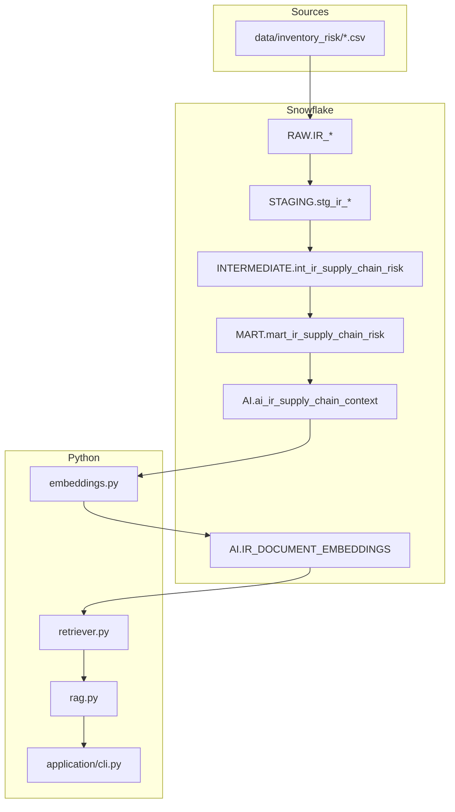

# Architecture — AI Supply Chain Inventory Risk Assistant

## Overview

End-to-end pipeline for a **Supply Chain Planner** to ask natural-language questions about inventory risk, with **deterministic KPIs in Snowflake/dbt** and **AI for explanation only**.

## Design principle

| Layer | Responsibility | Must NOT do |
|-------|----------------|-------------|
| **Snowflake + dbt** | KPIs, risk scores, recommended actions | Natural language |
| **Python + RAG** | Retrieval, summarization, explanation | Invent KPI values |

## Data flow

1. **Ingest** — `scripts/load_inventory_risk_to_snowflake.py` loads 5 CSVs into `RAW.IR_*`
2. **Transform** — dbt builds staging → intermediate → mart → AI context
3. **Embed** — `python -m src.ai.embeddings` writes vectors (incremental by `document_hash`)
4. **Retrieve** — `VECTOR_COSINE_SIMILARITY` + metadata filters
5. **Answer** — RAG prompt + LLM → structured response with sources

## Repository tracks

This repo contains three coexisting tracks:

| Track | Use case |
|-------|----------|
| `models/inventory_risk/` | **Simple E2E AI demo** (this document) |
| `models/control_tower/` | Complex control tower (30 products) |
| `models/raw`, `marts/` | Legacy automotive reference |

## Security

- Credentials via `.env` only — never committed
- Snowflake key-pair auth
- Docker image contains no secrets (mount at runtime)
- Logs exclude API keys and passphrases

## Deployment options

| Environment | Approach |
|-------------|----------|
| Local (Cursor) | `.env` + CLI |
| Docker | `docker run --env-file .env -v key:/keys/rsa_key.p8` |
| GitHub Actions | Repository secrets for Snowflake + LLM keys |

See [deployment.md](deployment.md) for commands.
