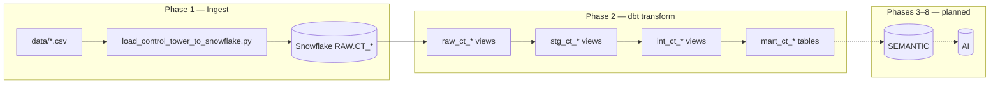

# Project Guide — AI Supply Chain Control Tower

Plain-English onboarding for the interview demo. Legacy automotive models are out of scope here unless noted.

---

## What this project does

Simulates a **consumer-products supply chain** (30 SKUs, 8 global warehouses, 15 suppliers) and transforms it into analytics-ready marts that flag:

- Stockout and excess inventory risk
- Supplier OTD/OTIF problems
- Shipment delays
- Customer fulfillment gaps
- Warehouse capacity pressure

Data is synthetic but **scenario-driven**: Coconut Water in London, Baby Formula, and several suppliers are intentionally in critical/high-risk states so demos have something interesting to query.

---

## Architecture



**Schemas in Snowflake** (shared by both tracks):

| Schema | Role |
|--------|------|
| `RAW` | Landing zone — `CT_*` source tables + legacy tables |
| `STAGING` | Cleaned views (`stg_ct_*`, `stg_*`) |
| `INTERMEDIATE` | Reusable business logic (`int_ct_*`, `int_*`) |
| `MART` | Analytics tables (`mart_ct_*`, `dim_*`, `fact_*`) |
| `SEMANTIC` | Planned — MetricFlow / semantic layer (Phase 3) |
| `AI` | Planned — embeddings, RAG artifacts (Phase 4+) |

---

## Data flow (step by step)

1. **`scripts/generate_control_tower_data.py`** writes 8 CSV files to `data/`.
2. **`scripts/load_control_tower_to_snowflake.py`** runs `snowflake/01`–`04` DDL, then loads CSVs into `ANALYTICS.RAW.CT_*`.
3. **dbt sources** (`models/control_tower/raw/sources.yml`) declare the `CT_*` tables.
4. **`raw_ct_*`** — thin views over sources.
5. **`stg_ct_*`** — typing, renaming, light cleansing.
6. **`int_ct_*`** — joins and metrics (inventory position, demand, supplier/shipment performance, etc.).
7. **`mart_ct_*`** — subject-area marts; **`mart_ct_supply_chain_risk`** rolls everything up.

---

## Naming conventions

| Layer | Control Tower | Legacy (reference) |
|-------|---------------|-------------------|
| Snowflake RAW | `CT_PRODUCTS`, `CT_INVENTORY`, … | `supplier`, `inventory`, … |
| dbt raw views | `raw_ct_products` | `raw_supplier` |
| Staging | `stg_ct_products` | `stg_supplier` |
| Intermediate | `int_ct_inventory_position` | `int_supplier_performance` |
| Marts | `mart_ct_supply_chain_risk` | `dim_supplier`, `fact_inventory`, `kpi_*` |

**Rule of thumb:** if it has `ct_` in the model name, it's Control Tower.

**dbt selectors:**

```bash
dbt build --select control_tower          # demo path only
dbt build --exclude control_tower         # legacy path only
dbt build                                 # everything
```

---

## Control Tower marts (Phase 2)

| Model | Purpose |
|-------|---------|
| `mart_ct_inventory_health` | Days of supply, stockout/excess flags |
| `mart_ct_demand_health` | Forecast accuracy and bias |
| `mart_ct_supplier_health` | Supplier OTD, OTIF, lead time |
| `mart_ct_shipment_health` | Inbound delay rates |
| `mart_ct_customer_fulfillment` | Fill rate, backorders, OTIF |
| `mart_ct_supply_chain_risk` | **Unified risk scorecard** (start here) |

---

## Phase roadmap

| Phase | Scope | Status |
|-------|-------|--------|
| **1** | CSV dataset, Snowflake DDL, `CT_*` RAW load | **Done** |
| **2** | dbt `models/control_tower/` (raw → marts) + tests | **Done** |
| **3** | Semantic layer (`SEMANTIC` schema, MetricFlow metrics) | Not started |
| **4** | AI-ready views / features in `AI` schema | Not started |
| **5** | Python `src/` RAG / agent package | Not started |
| **6** | API or chat UI over marts | Not started |
| **7** | Observability, alerting on risk marts | Not started |
| **8** | CI/CD (GitHub Actions), scheduled runs | Not started |

See [current_state.md](current_state.md) for row counts, connection details, and blockers.

---

## Embedded demo scenarios

The generator seeds these stories into the data:

| Scenario | Where to look |
|----------|---------------|
| Coconut Water stockout (London) | `mart_ct_supply_chain_risk` where `product_id = 'P001'` |
| Baby Formula / Frozen Pizza critical | `is_stockout_risk = TRUE` on high-priority SKUs |
| Rice reallocation (Dallas excess → Mumbai low) | `mart_ct_inventory_health` |
| Rotterdam capacity ~93% | `mart_ct_supply_chain_risk.is_capacity_risk` |
| High-risk suppliers | `mart_ct_supplier_health` + `tests/assert_ct_high_risk_suppliers_flagged.sql` |

---

## Local setup checklist

- [ ] Copy `.env.example` → `.env` (do not commit `.env`)
- [ ] Snowflake key-pair at path in `SNOWFLAKE_PRIVATE_KEY_PATH`
- [ ] `export DBT_PROFILES_DIR=/path/to/dbt_project`
- [ ] `python3 scripts/load_control_tower_to_snowflake.py`
- [ ] `dbt deps && dbt build --select control_tower`
